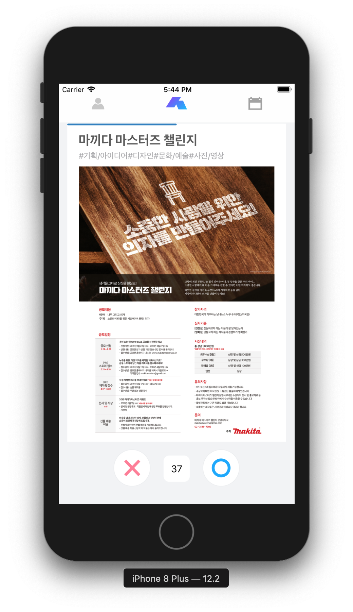
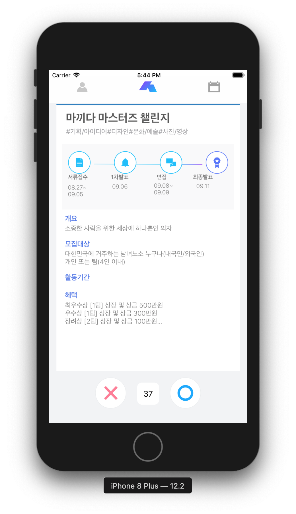

# 대학생활정보 큐레이션 서비스 슥삭 - iOS

## About

대학교 포스터 게시판은 덕지덕지, 스펙 웹사이트들은 어질어질 한 대학생들을 위해 대학생들이 직접 만들었습니다.
슥삭은 대학생들이 정보탐색의 굴레에서 벗어날 수 있도록, 1분만에 나에게 필요한 정보만 정리할 수 있도록 만든 어플리케이션 입니다.

#### [큐레이션을 위한 정보입력]

- 자신의 학교정보와 관심분야, 구직여부를 설정해보세요. 여러분이 관심있어할 정보들만 개인맞춤으로 제공해 드립니다.
- 앱을 사용할수록 여러분이 어떤 정보를 필요로 하는지 분석하여 점점 더 정확한 큐레이션으로 발전됩니다.

#### [1분만에 슥삭 정리하기]

- 나에게 큐레이션 된 정보를 포스터카드와 요약된 텍스트카드를 통해 빠르게 정리해보세요.
- 필요한 정보는 오른쪽으로 슥 넘겨서 저장하고, 필요없는 정보는 왼쪽으로 삭 삭제하면 끝!
- 하루에 1분이면 필요한 정보를 저장할 수 있습니다.

#### [나만의 대학생활 캘린더]

- 내게 필요한 정보를 저장하면 나의 캘린더에서 한 눈에 볼 수 있어요.
- 투두리스트에 D-day 가 표시되어 지원마감일을 놓치지 않게 도와드려요.
- 투두리스트에서 해당 활동을 더 자세히 볼 수 있고, 웹사이트로 이동, 공유하기, 알림 기능을 사용할 수 있어요.

#### [추가 기능]

- 나의 이력: 나의 이력을 미리 간단히 적어놓으면 나중에 이력서 쓸 때 굉장히 편리해져요. 또한 내가 부족한 이력 부분이 무엇인지도 확인할 수 있어요.

나를 위한 대학생 필수정보 큐레이션 서비스_슥삭

여러분의 피드백을 통해 더욱더 편리한 어플로 발전됩니다. 많은 피드백 부탁드려요 :)

카카오플러스친구 ID : 슥삭
문의 및 피드백 메일 : ssgsag.univ@gmail.com

## Feature

### 스와이프

### 캘린더

### 이력관리

### 마이페이지

### 상세페이지

## Develop Environment

- Language: Swift 4.0

## Open Source Library

- [Lottie-iOS](https://github.com/airbnb/lottie-ios)
- [SearchTextField](https://github.com/apasccon/SearchTextField)
- [SwiftKeychainWrapper](https://github.com/jrendel/SwiftKeychainWrapper)
- [FBSDKCoreKit](https://github.com/facebook/facebook-swift-sdk)

-----

[슥삭 페이지](https://www.ssgsag.kr/)

